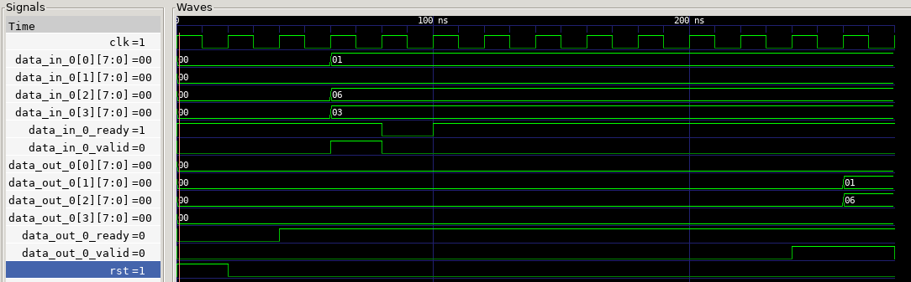
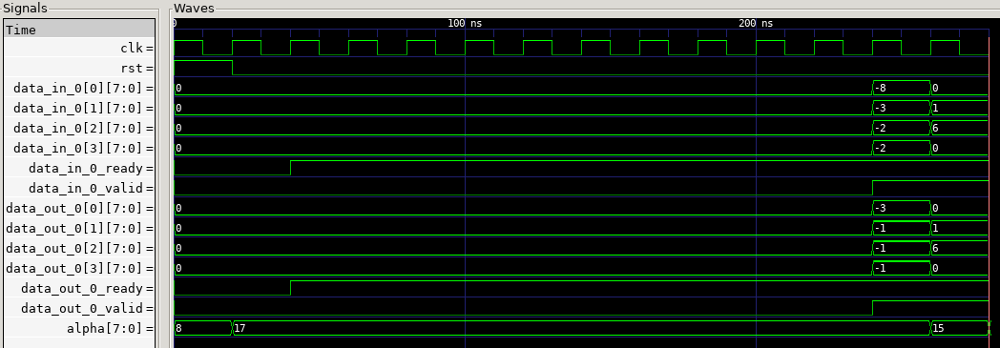

### **Task 1: Hardware Metadata Pass**

The hardware metadata pass is a critical component in MASE's hardware generation pipeline that maps each node in the neural network graph to actual hardware components.

The hardware metadata has several key purposes. Firstly, it determines the toolchain for each layer, either using pre-built internal RTL modules from the MASE components library, High-Level Synthesis or external components. Secondly, it specifies all the Verilog parameters needed to customize each hardware module. These parameters follow strict naming conventions and include data precision (total bit width and number of fractional bits), tensor dimensions and parallelism factors. The parallelism parameters determine how much of the computation happens in parallel versus sequentially, directly impacting hardware area and latency. 

Lastly, it defines the interface specifications for parameters like weights and biases, determining whether they should be stored in BRAM (Block RAM), whether data needs to be transposed before emission, and how data flows between modules using valid-ready handshaking protocols.

#### **How Hardware Metadata Differs from Software Metadata**

Software metadata focuses on characteristics needed for software execution and optimization, such as floating-point opeations per second, memory access patterns, parameter counts, and computational complexity for profiling and optimization. In contrast, hardware metadata is concerned with the physical implementation of the neural network in silicon or FPGA fabric. It specifies concrete details like the exact bit widths for fixed-point arithmetic, how many parallel processing units to instantiate, which hardware blocks to use, what memory interfaces are needed, and how modules connect via wires and handshaking signals. Overall software metadata can be more abstract and focused on algorithmic properties, while hardware metadata must be completely concrete and implementation-specific. 

### **Task 2: top.sv Analysis**

The top.sv module represents the hardware implementation of the MLP model, which consists of a single fully-connected layer with 4 inputs and 8 outputs, followed by a ReLU activation function. 

The module begins with a parameter list that configures all the submodules. The parameters are organized by component (prefixed with `fc1_` for the linear layer and `relu_` for the activation). Each component has parameters for input precision, tensor dimensions, and parallelism factors (`PARALLELISM_DIM_0 = 4` means all 4 elements are processed in parallel).

The module interface follows a standard streaming protocol with `clk` and `rst` signals for synchronization. Data flows through arrays: `data_in_0[3:0]` provides 4 parallel 8-bit inputs, while `data_out_0[3:0]` produces 4 parallel outputs (though the output has 8 elements total, processed in two cycles). The valid-ready handshaking signals (`data_in_0_valid`, `data_in_0_ready`, `data_out_0_valid`, `data_out_0_ready`) implement backpressure, allowing the module to stall when downstream components aren't ready.

The design instantiates three main types of components. First is the `fixed_linear` module, which implements the linear transformation y = Wx + b. It takes the input data stream, multiplies it with weights using parallel dot product units, adds biases, and produces the transformed output.

Second are the memory source modules (`fc1_weight_source_0` and `fc1_bias_source_0`), which are implemented as Block RAM (BRAM) components. These modules were generated by the `emit_bram_transform_pass` and contain the quantized weight and bias values from the trained PyTorch model. They continuously provide weight and bias data to the linear layer through ready-valid interfaces, essentially acting as ROM (Read-Only Memory) that streams parameter values when requested.

Third is the `fixed_relu` module, which implements the ReLU activation function, outputting zero for negative inputs. The module processes each element in parallel using combinational logic: if the input is positive, it passes through unchanged; if negative, it's multiplied by the negative slope (implemented as a fixed-point multiplication followed by a right shift to maintain precision).

This design creates a streaming datapath where input tensors flow from left to right: **data_in_0 → fc1 (Linear) → leaky_relu → data_out_0**. The valid-ready handshaking ensures that data only moves forward when all stages are ready to accept it, preventing data loss and allowing the pipeline to handle varying input rates gracefully.

### **Task 3: Simulation Results**
From the notebook output, the original ReLU-based simulation showed:
- **Simulation time**: 280.00 ns (simulated hardware time)
- **Wall clock time**: 53.23 seconds (real execution time) 
- **Build time**: 24.03 seconds
- **Test time**: 57.42 seconds total
- **Time ratio**: 5.26 ns/s (simulation speed)
- **Test status**: PASSED
- **Output values**: First beat `[0, 0, 0, 0]`, Second beat `[0, 6, 1, 0]` (matched expected `[0, 6, 2, 0]` with minor deviation)

Note:
- **Test time**: Total time for the entire test run = build time + simulation execution time + testbench overhead
- **Simulation time**: The actual hardware time being simulated (280 ns for both)
- **Wall clock time**: Real-world time to execute the compiled simulation

### **Extension Task: Random Leaky ReLU (RReLU) Implementation**

#### Implementation

To implement RReLU, the original ReLU activation was replaced with a randomized leaky slope for negative inputs. A pseudo-random slope parameter (alpha) was generated using an 8-bit LFSR and then used to scale negative activiations, while positive activiations pass through unchanged. The LFSR updates once per accepted input cycle (gated by the ready/valid handshake). Since the output tensor length is 8 and the parallelism is 4, the 8 outputs are emitted in two consecutive cycles, each cycle having its own pseudo-random alpha parameter. 

The alpha mapping targets a uniform distribution in the range [0.125, 0.333]. The 4 LSBs were used from the LFSR state, giving 16 possible states. These 4 bits are scaled into the target range using a simple mapping, note that alpha is represented in Q2.6 format (where 0.25 = 8/64 and 0.333 approximates to 21/64):

$$
\alpha = 8 + \left\lfloor \frac{\text{LFSR}[3:0] \cdot 13}{16} \right\rfloor
$$

- **Example Computation**: For input = -1 (Q5.3) and alpha = 17 (Q2.6 ≈ 0.266):
  - Product: -1 × 17 = -17 (Q7.9 format with 9 fractional bits)
  - Right shift by 6: -17 >>> 6 = -1 (restoring Q5.3 format)
  - Output: -1 (small negative value preserved)
 

The waveform analysis shows outputs like [-1, -1, -1, -3] in signed decimal, confirming that negative inputs are scaled by the random slope rather than zeroed.

Due to the Q5.3 format, many negative numbers cannot be represented exactly and must quantise to the nearest available level (smallest negative level is -0.125 or 0xFF in Q5.3). This introduces small numerical deviations from floating-point behaviour, the resulting error is bounded to within one least significant bit (LSB) and is generally negligible for inference accuracy. This hardware design therefore prioritises deterministic, low-cost arithmetic over bit-exact matching with floating-point RReLU.

The -3 comes from the fact that after the multiplication and shift, the result is computed by $17 * (-8) = -136$, then $-136/64 = -2.125$, it floors to the larger negative number. 

#### RReLU Simulation Results

From the RReLU test execution:
- **Simulation time**: 280.00 ns (identical to ReLU - same hardware cycles)
- **Wall clock time**: 290.36 seconds (real execution time)
- **Build time**: 262.04 seconds (Verilator compilation time - **10.9× slower than ReLU**)
- **Test time**: 324.34 seconds total
- **Time ratio**: 0.96 ns/s (simulation speed)
- **Test status**: PASSED
- **Output values**: First beat `[-1, -1, -1, -3]`, Second beat `[0, 6, 1, 0]` 

#### Build Time and Simulation Performance

The RReLU implementation exhibits significantly increased build/compilation time compared to standard ReLU. This describes the time Verilator takes to translate SystemVerilog RTL into C++ models. This increased time is caused by:

1. **Fixed-Point Multiplier Complexity**: The activation layer uses `$signed(alpha) * $signed(data_in_0[i])` in SystemVerilog, requiring Verilator to generate C++ code to model this 8-bit × 8-bit signed multiplication. Although it still defaults to using fixed-point multipliers since the signals are declared as `logic [7:0]` (fixed precision), the multiplier still demands much more complex C++ code than simple comparisons (ReLU), including sign extension logic, partial product generation, product accumulation and overflow detection. 

2. **LFSR Module Instantiation**: The `lfsr_alpha_generator` adds state registers, XOR feedback polynomial logic, and combinational mapping circuits. The LFSR includes clocked sequential logic, which requires more elaborate timing and state update models compared to purely combinational logic.

Despite the increased build time, the simulated hardware time remains identical (280 ns) because RReLU is implemented with single-cycle combinational logic.

#### Other Accuracy and Quantization Effects

In the RReLU, quantisation effects occur from both the alpha representation and the fixed-point multiply/shift. Since alpha is represented using Q2.6, it has a resolution of 1/64 ≈ 0.0156, which is sufficient for the randomization purpose but limits precision compared to floating-point. The LFSR also produces deterministic pseudo-random sequences based on the seed. Different seeds will produce different alpha sequences, but the same seed guarantees reproducibility across runs. 

Multiplying Q5.3 inputs with Q2.6 alpha produces a Q7.9 result and becomes Q7.3 after the right shift by 6. Since the right shift in SystemVerilog performs flooring rather than rounding, it may differ from PyTorhc's RReLU behavior by around ±1 LSB. Finally, only the 8 lower bits are kept from Q7.3, resulting in the limitation of large negative numbers. For inference, the quantization effects are generally negligible. However, for training using hardware, the lack of rounding and limited alpha precision may cause gradient approximation errors. 
